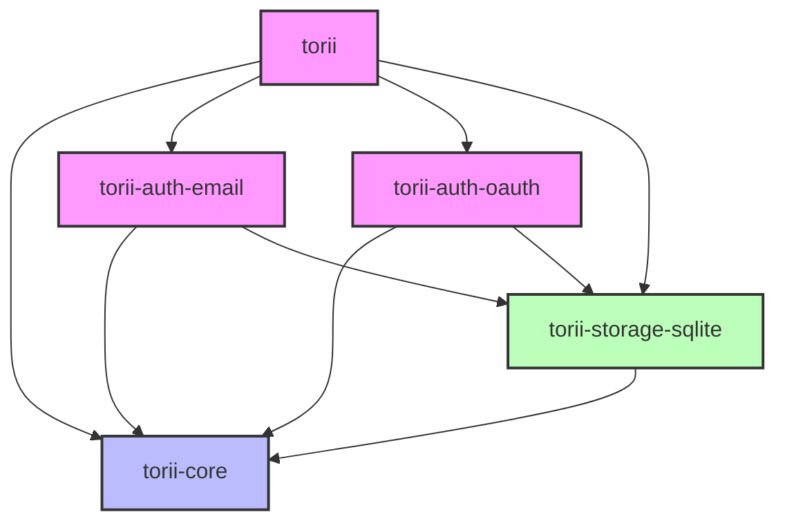

# Torii Architecture

```mermaid
graph TD
    torii[torii]
    torii_core[torii-core]
    torii_auth_email[torii-auth-email]
    torii_auth_oauth[torii-auth-oauth]
    torii_storage_sqlite[torii-storage-sqlite]

    %% Core dependencies
    torii_auth_email --> torii_core
    torii_auth_oauth --> torii_core
    torii_storage_sqlite --> torii_core

    %% Main crate dependencies
    torii --> torii_core
    torii --> torii_auth_email
    torii --> torii_auth_oauth
    torii --> torii_storage_sqlite

    %% Storage dependencies
    torii_auth_email --> torii_storage_sqlite
    torii_auth_oauth --> torii_storage_sqlite

    %% Style nodes
    classDef default fill:#f9f,stroke:#333,stroke-width:2px;
    classDef core fill:#bbf,stroke:#333,stroke-width:2px;
    classDef storage fill:#bfb,stroke:#333,stroke-width:2px;

    class torii_core core;
    class torii_storage_sqlite storage;
```
